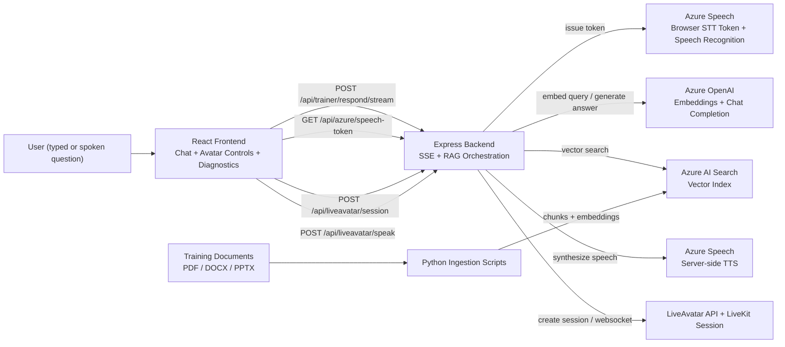

# LiveAvatar Trainer

RAG-enabled live avatar trainer built with React, Express, Azure OpenAI, Azure AI Search, Azure Speech, and LiveAvatar.

This project turns private training material into a streaming, voice-enabled coaching experience. Users can ask typed or spoken questions, retrieve grounded answers from indexed documents, and hear those answers delivered through a live avatar session.

## Repo Description

Voice-enabled RAG training assistant using Azure OpenAI, Azure AI Search, Azure Speech, React, and a LiveAvatar frontend.

## Why This Repo Exists

- Turn internal PDFs, slide decks, and docs into a searchable training assistant
- Stream answers in real time instead of waiting for a full completion
- Support voice input and avatar-delivered output
- Expose RAG diagnostics so latency and retrieval quality are easier to tune

## Highlights

- React chat UI with streaming token updates
- Express backend for RAG orchestration and SSE delivery
- Azure OpenAI for embeddings and chat completions
- Azure AI Search for vector retrieval
- Azure Speech for browser speech-to-text and server-side text-to-speech
- LiveAvatar session, speak, and interrupt endpoints
- Python ingestion pipeline for PDF, DOCX, and PPTX content

## Screenshots

### Chat Experience


### Diagnostics Panel


## Demo

- Demo storyboard: [docs/demo-script.md](docs/demo-script.md)
- Video placeholder: `docs/assets/demo-video-placeholder.md`
- GIF placeholder: `docs/assets/demo-gif-placeholder.md`

Recorded media can be dropped into `docs/assets/` later without changing the README structure.

## Architecture Diagram



Detailed version: [docs/architecture.md](docs/architecture.md)

## Repository Structure

```text
.
├── backend/                 # Express API, RAG routes, Azure + avatar integrations
├── frontend/                # React/Vite chat application
├── rag/                     # Python indexing and ingestion scripts
├── docs/                    # Architecture, demo assets, deployment notes
├── sample-data/             # Example prompts and sample training corpus structure
├── .env.example             # Unified environment template
└── docker-compose.yml       # Full-stack local container setup
```

## Tech Stack

- Frontend: React 19, Vite
- Backend: Node.js, Express, SSE
- AI: Azure OpenAI
- Retrieval: Azure AI Search
- Voice: Azure Speech
- Avatar: LiveAvatar + LiveKit
- Ingestion: Python 3.10+, PyMuPDF, python-pptx

## Quick Start

### 1. Clone and install

```bash
git clone https://github.com/adityaraoyt/RAG-Enabled-Live-Avatar-Azure.git
cd RAG-Enabled-Live-Avatar-Azure
npm --prefix backend install
npm --prefix frontend install
python3 -m pip install -r rag/requirements.txt
```

### 2. Configure environment

```bash
cp .env.example .env
```

Fill in the Azure and LiveAvatar values you plan to use. The backend reads from the root `.env` when started from `backend/`, and the Python ingestion scripts also load the same file.

### 3. Run the backend

```bash
cd backend
npm run dev
```

Backend default: [http://localhost:5050](http://localhost:5050)

### 4. Run the frontend

```bash
cd frontend
npm run dev
```

Frontend default: [http://localhost:5173](http://localhost:5173)

## Environment Variables

Use [.env.example](/Users/adityarao/Desktop/LiveAvatar/.env.example) as the starting point.

### Required backend variables

```env
PORT=5050
CORS_ORIGIN=http://localhost:5173

AZURE_SEARCH_SERVICE=https://<your-search>.search.windows.net
AZURE_SEARCH_ADMIN_KEY=<your-search-admin-key>
AZURE_SEARCH_INDEX=training-index

AZURE_OPENAI_ENDPOINT=https://<your-openai-resource>.openai.azure.com
AZURE_OPENAI_API_KEY=<your-openai-key>
AZURE_OPENAI_API_VERSION=2024-06-01
AZURE_OPENAI_CHAT_DEPLOYMENT=gpt-4o-mini
AZURE_OPENAI_EMBEDDING_DEPLOYMENT=text-embedding-3-small

AZURE_SPEECH_KEY=<your-speech-key>
AZURE_SPEECH_REGION=<your-speech-region>

LIVEAVATAR_API_KEY=<your-liveavatar-api-key>
LIVEAVATAR_BASE_URL=https://api.liveavatar.com/v1
```

### Optional frontend variables

```env
VITE_API_BASE_URL=
VITE_LIVEAVATAR_AVATAR_ID=<your-avatar-id>
```

Set `VITE_API_BASE_URL` only if the frontend is calling a backend hosted on a different origin. For local dev with the Vite proxy or for Docker with Nginx proxying `/api`, it can stay blank.

## API Surface

### Health

- `GET /health`

### RAG

- `POST /api/rag/answer`
- `POST /api/trainer/respond`
- `POST /api/trainer/respond/stream`

### Speech + Avatar

- `GET /api/azure/speech-token`
- `POST /api/liveavatar/session`
- `POST /api/liveavatar/speak`
- `POST /api/liveavatar/interrupt`

## Sample Requests

### Streaming trainer response

```bash
curl -N -X POST http://localhost:5050/api/trainer/respond/stream \
  -H "Content-Type: application/json" \
  -d '{
    "conversationId": "demo-conversation",
    "question": "Summarize powers to arrest in plain language",
    "topK": 6
  }'
```

### Non-streaming response

```bash
curl -X POST http://localhost:5050/api/trainer/respond \
  -H "Content-Type: application/json" \
  -d '{
    "question": "Give me the main learning objectives for the introduction module",
    "topK": 6
  }'
```

## Sample Data

The repo now includes example data and prompts under [sample-data/](/Users/adityarao/Desktop/LiveAvatar/sample-data):

- `seed-questions.json` for demo prompts
- `sample-corpus/` showing the expected course/module folder layout
- `expected-index-record.json` showing what one indexed chunk looks like

If you want to ingest your own content, mirror the directory shape under `sample-data/sample-corpus/` inside your real `DOCS_ROOT`.

## Document Ingestion

The ingestion tool supports `.pdf`, `.docx`, and `.pptx` files and writes chunked vectors into Azure AI Search.

### Create or update the index

```bash
cd rag
python3 create_index.py
```

### Ingest documents

```bash
cd rag
python3 ingest_docs.py
```

Useful ingestion variables:

- `DOCS_ROOT`
- `CHECKPOINT_PATH`
- `CHUNK_MAX_CHARS`
- `CHUNK_OVERLAP`
- `EMBED_BATCH_SIZE`
- `UPLOAD_BATCH_SIZE`

## Docker Support

Run the full stack locally with Docker Compose:

```bash
docker compose up --build
```

Services:

- `backend` on `http://localhost:5050`
- `frontend` on `http://localhost:8080`

The frontend container proxies `/api` requests to the backend container, so same-origin browser traffic works without setting `VITE_API_BASE_URL`.

## Deployment Steps

Detailed guide: [docs/deployment.md](docs/deployment.md)

### Option 1: Azure App Service + Static Web Apps

1. Deploy `backend/` as a Node.js web app or container.
2. Set all backend environment variables from `.env.example`.
3. Deploy `frontend/` to Azure Static Web Apps or any static host.
4. Set `VITE_API_BASE_URL` to your deployed backend URL during frontend build.
5. Confirm CORS allows the frontend origin.

### Option 2: Containers

1. Build and push the backend image from `backend/Dockerfile`.
2. Build and push the frontend image from `frontend/Dockerfile`.
3. Inject environment variables from your secret store.
4. Route `/api` traffic from the frontend container to the backend service.
5. Validate `/health`, then test trainer streaming, speech token, and avatar session endpoints.

## Local Development Workflow

### Terminal 1

```bash
cd backend
npm run dev
```

### Terminal 2

```bash
cd frontend
npm run dev
```

### Terminal 3, optional

```bash
cd rag
python3 ingest_docs.py
```

## Known Gaps

- No persistent database for chat history yet; conversations are in memory
- Retrieval ranking is heuristic and can be improved with stronger fusion/reranking

## Roadmap

- Persist chat history and session metadata
- Add authentication and role-based access
- Add automated tests for RAG routes and speech/avatar integrations
- Add background ingestion jobs and admin controls
- Improve observability with request tracing and hosted dashboards


